<h2>TensorFlow-FlexUNet-Image-Segmentation-MNI-HISUB25-Hippocampal-Subfield-T2W (2026/04/07)</h2>
Sarah T. Arai 
Software Laboratory antillia.com  
This is the first experiment of Image Segmentation for <b>MNI-HISUB25-T2W</b>
 based on 
our <a href="./src/TensorFlowFlexUNet.py">TensorFlowFlexUNet</a>
 (<b>TensorFlow Flexible UNet Image Segmentation Model for Multiclass</b>), and a 512x512 pixels PNG
 <a href="https://drive.google.com/file/d/1ImUGZWNXdlt8wj808SLrXIaOts7rGyf6/view?usp=sharing">
MNI-HISUB25-T2W-ImageMask-Dataset.zip</a> 
(<a href="https://creativecommons.org/licenses/by-nc-sa/3.0/legalcode.en">
CC BY-NC-SA 3.0</a>), which was derived by us from   
<a href="https://www.nitrc.org/projects/mni-hisub25">
<b>Multi-contrast and submillimetric 3-Tesla hippocampal subfield segmentation protocol and dataset (MNI-HISUB25)</b>
</a>
  

<b>Actual Image Segmentation for MNI-HISUB25-T2W Images of 512x512 pixels</b> 
As shown below, the inferred masks predicted by our segmentation model trained by the dataset appear similar to the 
ground truth masks.
  
<b>class_color_map ={Subiculum:blue, CA1-3:green, CA4-DG:red } </b>
  
<table>
<tr>
<th>Input: image</th>
<th>Mask (ground_truth)</th>
<th>Prediction: inferred_mask</th>
</tr>
<tr>
<td>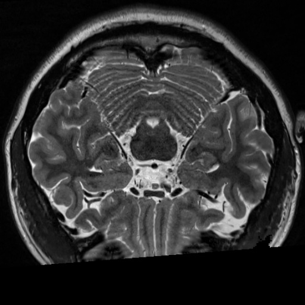</td>
<td>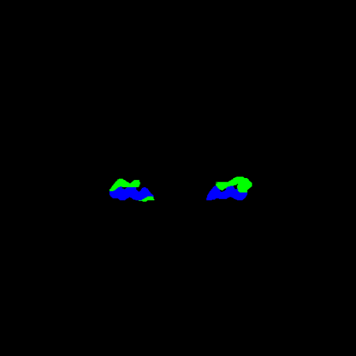</td>
<td>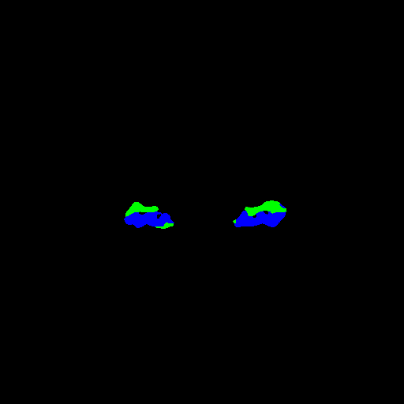</td>
</tr>

<tr>
<td>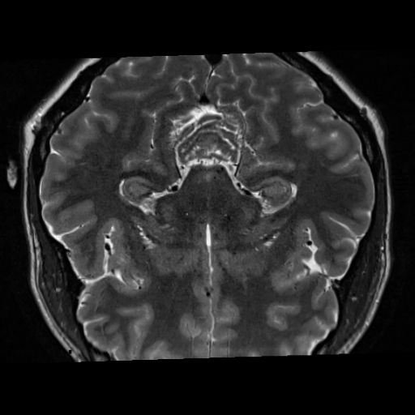</td>
<td>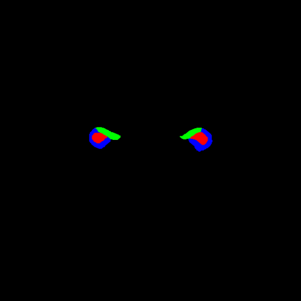</td>
<td>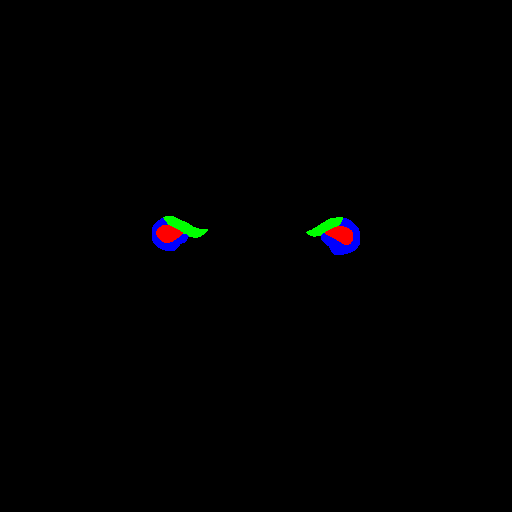</td>
</tr>

<tr>
<td>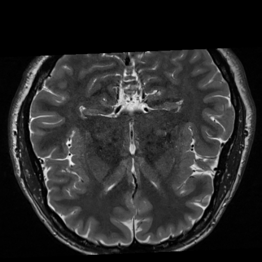</td>
<td>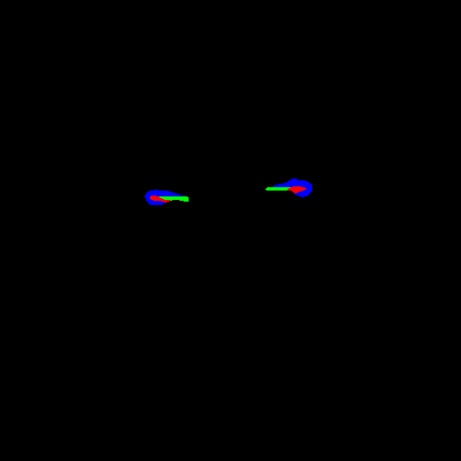</td>
<td>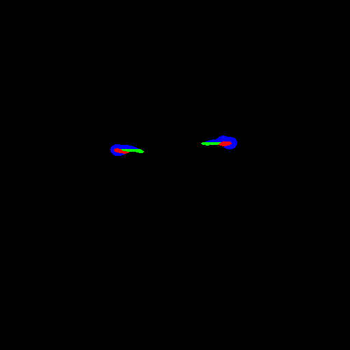</td>
</tr>
</table>

 

 
<h3>1. Dataset Citation</h3>
The dataset used here was taken from   
<a href="https://www.nitrc.org/projects/mni-hisub25">
<b>Multi-contrast and submillimetric 3-Tesla hippocampal subfield segmentation protocol and dataset (MNI-HISUB25)</b>
</a>
  
The following explanation was taken from the above web site.
  
<b>About Dataset</b> 
The MNI-HISUB25 dataset contains manual hippocampal subfield labels and associated high-resolution MRI 
data (submillimetric T1- and T2-weighted images, detailed sequence information, 
and stereotaxic probabilistic anatomical maps) based on 25 healthy subjects.  
Data were acquired on a 3-Tesla MRI system using a 32 phased-array head coil.   
The protocol divided the hippocampal formation into three subregions:  
<b>subicular complex,  
Cornu Ammonis 1, 2 and 3 (CA1-3),  
and CA4-dentate gyrus (CA4-DG).  
</b>
 
Segmentation was guided by consistent intensity and morphology characteristics of the densely 
myelinated molecular layer together with few geometry-based boundaries flexible to overall mesiotemporal 
anatomy, and achieved excellent intra-/inter-rater reliability (Dice index ≥90/87%).  
The dataset can inform neuroimaging assessments of the mesiotemporal lobe and help to develop segmentation 
algorithms relevant for basic and clinical neurosciences.

  

<b>License</b> 
<a href="https://creativecommons.org/licenses/by-nc-sa/3.0/legalcode.en">
Creative Commons Attribution-NonCommercial-ShareAlike 3.0 Unported (CC BY-NC-SA 3.0)
</a>
 
 
<h3>
<a id="2">
2 MNI-HISUB25-T2W ImageMask Dataset
</a>
</h3>
<h3>2.1 Download ImageMask Dataset</h3>
 If you would like to train this MNI-HISUB25-T2W Segmentation model by yourself,
 please download the dataset from the google drive  
 <a href="https://drive.google.com/file/d/1ImUGZWNXdlt8wj808SLrXIaOts7rGyf6/view?usp=sharing">
MNI-HISUB25-T2W-ImageMask-Dataset.zip</a> (
<a href="https://creativecommons.org/licenses/by-nc-sa/3.0/legalcode.en">
CC BY-NC-SA 3.0</a>)
, expand the downloaded ImageMaskDataset and put it under <b>./dataset</b> folder to be
 
<pre>
./dataset
└─MNI-HISUB25-T2W
    ├─test
    │   ├─images
    │   └─masks
    ├─train
    │   ├─images
    │   └─masks
    └─valid
        ├─images
        └─masks
</pre>
 
<b>MNI-HISUB25-T2W Statistics</b> 
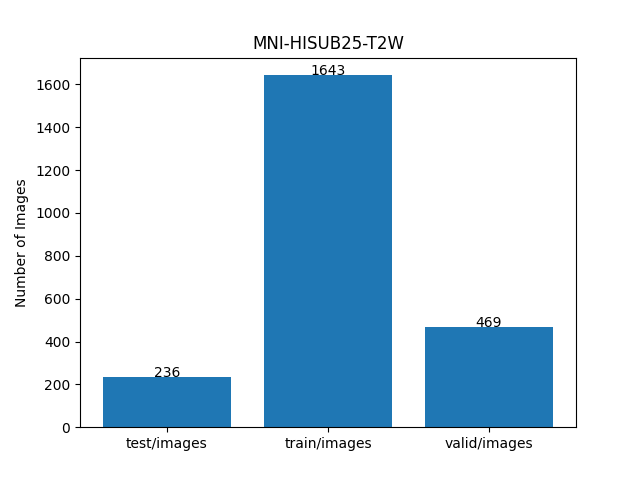 
  
As shown above, the number of images of train and valid datasets is not so large to use for the
 training set of our segmentation model.
  
<h3>2.2 Derivation of MNI-HISUB25-T2W </h3>
The folder structure of the orginal mri_dataset of MNI-HISUB25 is the following.  
<pre>
./mri_dataset
├─s01
│  ├─s01_hippolabels_hres_L_MNI.nii.gz
│  ├─s01_hippolabels_hres_R_MNI.nii.gz
│  ├─s01_hippolabels_t1w_standard_L_MNI.nii.gz
│  ├─s01_hippolabels_t1w_standard_R_MNI.nii.gz
│  ├─s01_t1w_hires_defaced_MNI.nii.gz
...
│  └─s01_t2w_hires_defaced_MNI.nii.gz

├─s02
...

└─s25
│  ├─s25_hippolabels_hres_L_MNI.nii.gz
│  ├─s25_hippolabels_hres_R_MNI.nii.gz
│  ├─s25_hippolabels_t1w_standard_L_MNI.nii.gz
│  ├─s25_hippolabels_t1w_standard_R_MNI.nii.gz
│  ├─s25_t1w_hires_defaced_MNI.nii.gz
...
│  └─s25_t2w_hires_defaced_MNI.nii.gz
...
</pre>
We used a simple Python script and the following class-color mapping table to generate our PNG dataset with colorized masks
from <b>s*_hippolabels_hres_L_MNI.nii.gz, s*_hippolabels_hres_R_MNI.nii.gz and s*_t2w_hires_defaced_MNI.nii.gz 
</b> NIfTI files.  
<table>
<tr><th>Index</th><th>Class</th><th>Color </th><th>RGB triplet</th></tr>
<tr>
<td>1</td><td>Subiculum</td><td>blue</td><td>(0,0,255)</td><tr>
<td>2</td><td>CA1-3</td><td>green</td><td>(0,255,0)</td><tr>
<td>3</td><td>A4-DG</td><td>red</td><td>(255,0,0)</td><tr>
</table>
 
 
<h3>2.3 Train Image and SmoothedMask Saｍples</h3>
<b>Train_images_sample</b> 
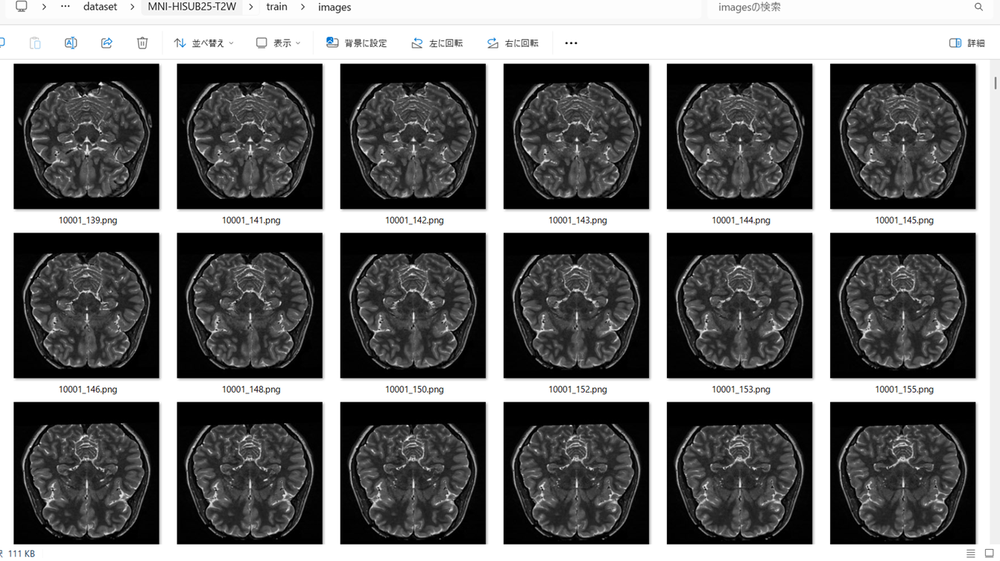
 
<b>Train_masks_sample</b> 
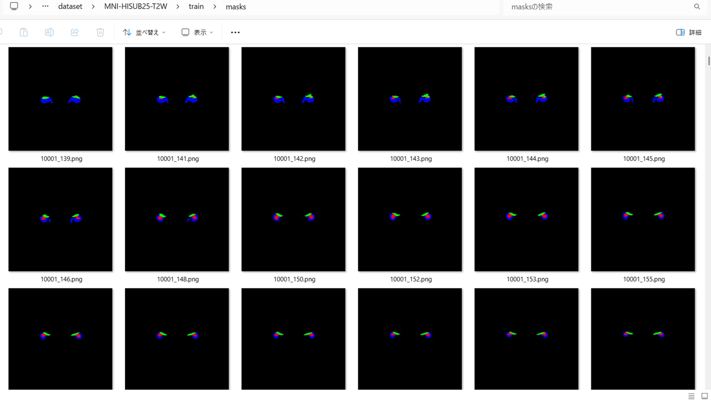
 
<h3>
3 Train TensorFlowFlexUNet Model
</h3>
 We trained MNI-HISUB25-T2W TensorFlowFlexUNet Model by using the 
<a href="./projects/TensorFlowFlexUNet/MNI-HISUB25-T2W/train_eval_infer.config"> <b>train_eval_infer.config</b></a> file.  
Please move to ./projects/TensorFlowFlexUNet/MNI-HISUB25-T2W and run the following bat file. 
<pre>
>1.train.bat
</pre>
, which simply runs the following command. 
<pre>
>python ../../../src/TensorFlowFlexUNetTrainer.py ./train_eval_infer.config
</pre>

<b>Model parameters</b> 
Defined a small <b>base_filters = 16 </b> and large <b>base_kernels = (11,11)</b> for the first Conv Layer of Encoder Block of 
<a href="./src/TensorFlowFlexUNet.py">TensorFlowFlexUNet.py</a> 
and a large num_layers (including a bridge between Encoder and Decoder Blocks).
<pre>
[model]
;You may specify your own UNet class derived from our TensorFlowFlexModel
model         = "TensorFlowFlexUNet"
image_width    = 512
image_height   = 512
image_channels = 3
input_normalize = True
normalization  = False
num_classes    = 4
base_filters   = 16
base_kernels   = (11,11)
num_layers     = 8
dropout_rate   = 0.04
dilation       = (1,1)
</pre>
<b>Learning rate</b> 
Defined a small learning rate.  
<pre>
[model]
learning_rate  = 0.00007
</pre>
<b>Loss and metrics functions</b> 
Specified "categorical_crossentropy" and <a href="./src/dice_coef_multiclass.py">"dice_coef_multiclass"</a>. 
<pre>
[model]
loss           = "categorical_crossentropy"
metrics        = ["dice_coef_multiclass"]
</pre>
<b>Dataset class</b> 
Specifed <a href="./src/ImageCategorizedMaskDataset.py">ImageCategorizedMaskDataset</a> class. 
<pre>
[dataset]
class_name    = "ImageCategorizedMaskDataset"
</pre>
 
<b>Learning rate reducer callback</b> 
Enabled learing_rate_reducer callback, and a small reducer_patience.
<pre> 
[train]
learning_rate_reducer = True
reducer_factor     = 0.4
reducer_patience   = 4
</pre>
<b>Early stopping callback</b> 
Enabled early stopping callback with patience parameter.
<pre>
[train]
patience      = 10
</pre>
<b>RGB Color map</b> 
Specifed rgb color map dict for MNI-HISUB25-T2W 1+3 classes. 
<pre>
[mask]
mask_datatyoe    = "categorized"
mask_file_format = ".png"
;MNI-HISUB25-T2W rgb color map dict for 1+3 classes.
;                      Subiculum,  CA1-3,	CA4-DG
rgb_map = {(0,0,0):0, (0,0,255):1,(0,255,0):2,(255,0,0):3 }
</pre>
<b>Epoch change inference callback</b> 
Enabled <a href="./src/EpochChangeInferencer.py">epoch_change_infer callback</a></b>. 
<pre>
[train]
epoch_change_infer       = True
epoch_change_infer_dir   =  "./epoch_change_infer"
num_infer_images         = 6
</pre>
By using this callback, on every epoch_change, the inference procedure can be called
 for 6 images in <b>mini_test</b> folder. This will help you confirm how the predicted mask changes 
 at each epoch during your training process.  
  
<!--
As shown below, early in the model training, the predicted masks from our UNet segmentation model showed 
discouraging results.
 However, as training progressed through the epochs, the predictions gradually improved. 
-->
   
 
<b>Epoch_change_inference output at starting (epoch 1,2,3)</b> 
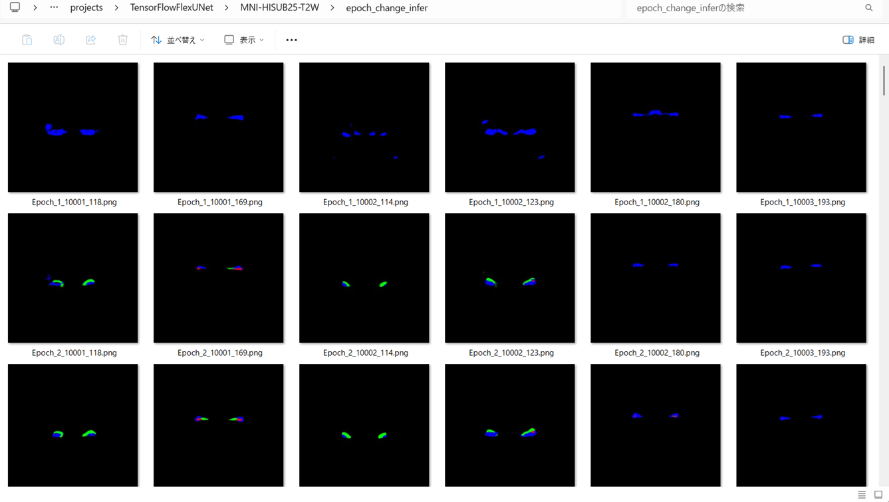 
 
<b>Epoch_change_inference output at middlepoint (epoch 31,32,33)</b> 
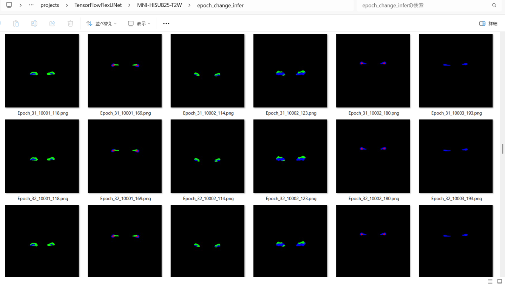 
 

<b>Epoch_change_inference output at ending (epoch 64,65,66)</b> 
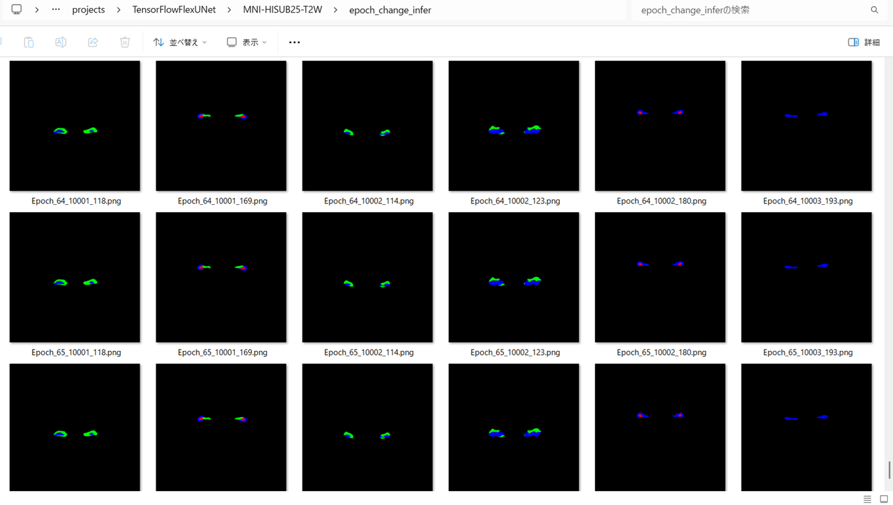 
 

In this experiment, the training process was stopped at epoch 66 by EarlyStopping callback.  
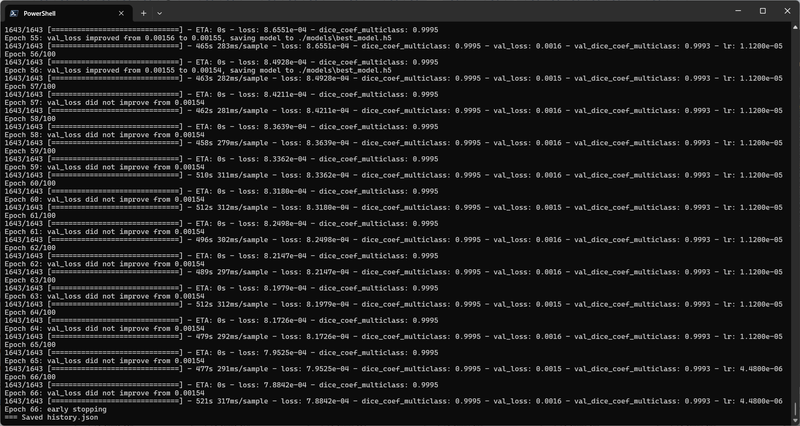 
 

<a href="./projects/TensorFlowFlexUNet/MNI-HISUB25-T2W/eval/train_metrics.csv">train_metrics.csv</a> 
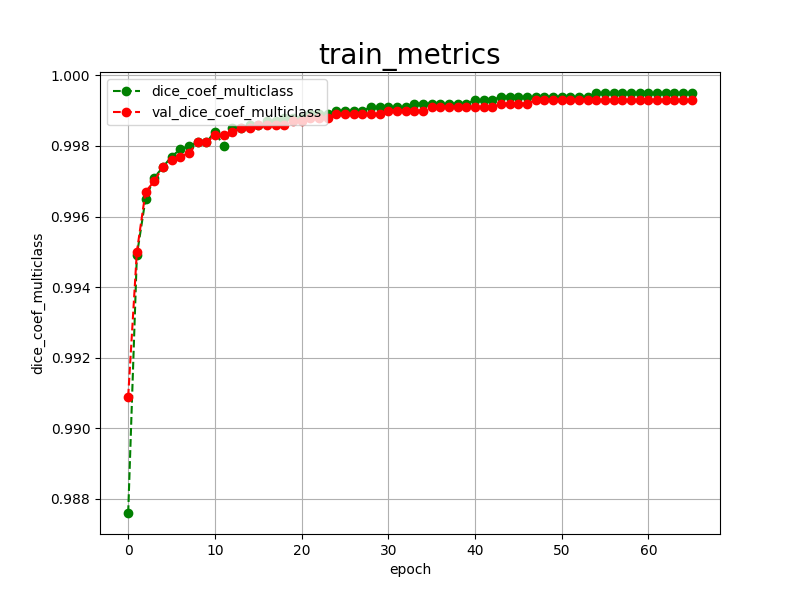 

 
<a href="./projects/TensorFlowFlexUNet/MNI-HISUB25-T2W/eval/train_losses.csv">train_losses.csv</a> 
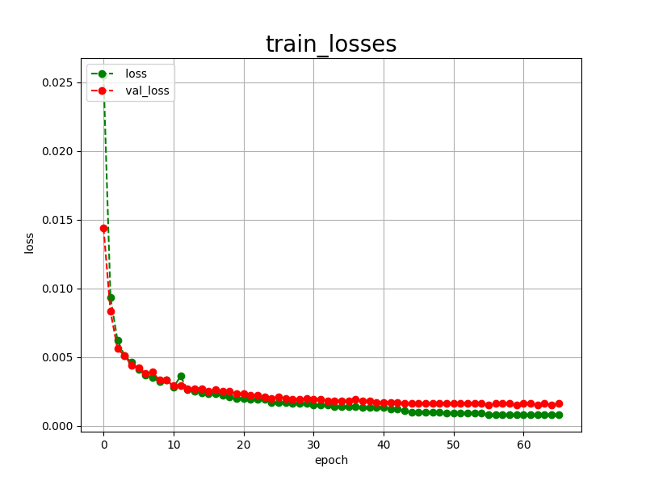 
 
<h3>
4 Evaluation
</h3>
Please move to <b>./projects/TensorFlowFlexUNet/MNI-HISUB25-T2W</b> folder, 
and run the following bat file to evaluate TensorFlowUNet model for MNI-HISUB25-T2W. 
<pre>
./2.evaluate.bat
</pre>
This bat file simply runs the following command.
<pre>
python ../../../src/TensorFlowFlexUNetEvaluator.py ./train_eval_infer_aug.config
</pre>

Evaluation console output: 
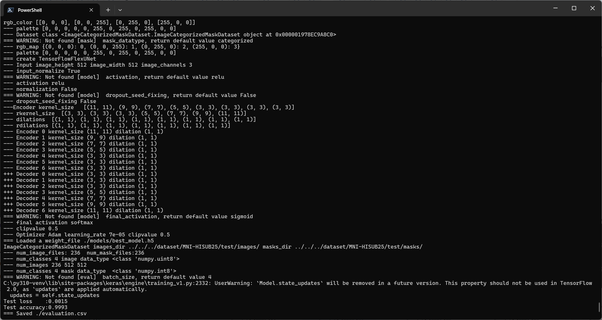
  Image-Segmentation-MNI-HISUB25-T2W

<a href="./projects/TensorFlowFlexUNet/MNI-HISUB25-T2W/evaluation.csv">evaluation.csv</a> 
The loss (categorical_crossentropy) to this <b>MNI-HISUB25-T2W/test</b> was very low, and dice_coef_multiclass very high as shown below.
 
<pre>
categorical_crossentropy,0.0015
dice_coef_multiclass,0.9993
</pre>
 
<h3>
5 Inference
</h3>
Please move to a <b>./projects/TensorFlowFlexUNet/MNI-HISUB25-T2W</b> folder, and run the following bat file to infer segmentation regions for images by the Trained-TensorFlowUNet model for MNI-HISUB25-T2W. 
<pre>
./3.infer.bat
</pre>
This simply runs the following command.
<pre>
python ../../../src/TensorFlowFlexUNetInferencer.py ./train_eval_infer_aug.config
</pre>

<b>mini_test_images</b> 
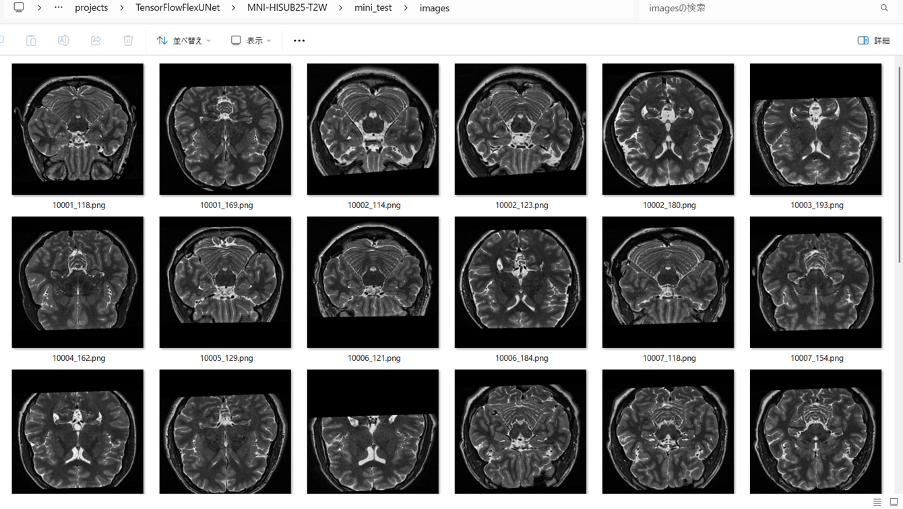 
<b>mini_test_mask(ground_truth)</b> 
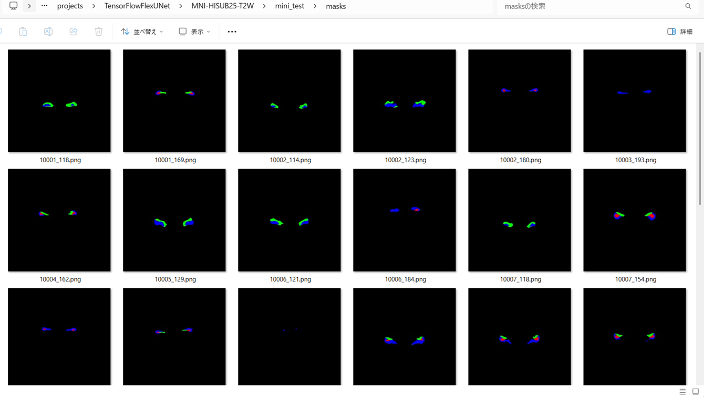 

<b>Inferred test masks</b> 
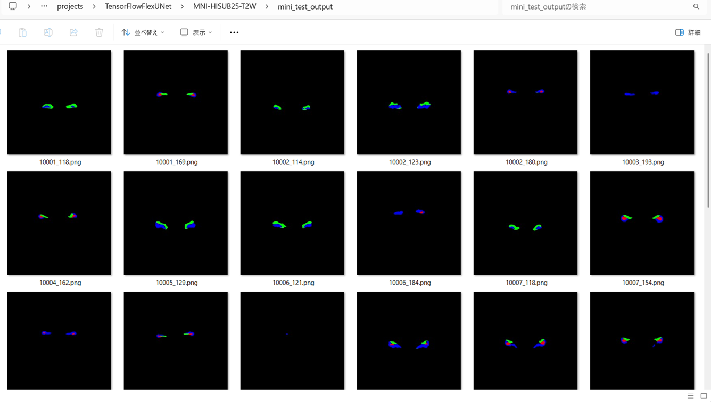 
 

<b>Enlarged images and masks of MNI-HISUB25-T2W Images of 512x512 pixels</b> 
As shown below, the inferred masks predicted by our segmentation model trained by the dataset appear similar to the
ground truth masks.
  
<b>class_color_map ={Subiculum:blue, CA1-3:green, CA4-DG:red } </b>
  
<table>
<tr>
<th>Image</th>
<th>Mask (ground_truth)</th>
<th>Inferred-mask</th>
</tr>
<tr>
<td>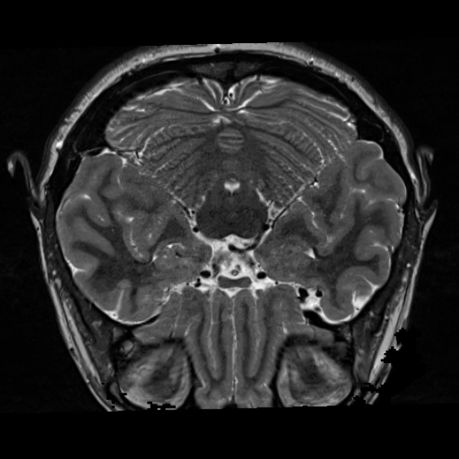</td>
<td></td>
<td>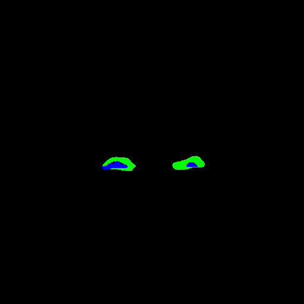</td>
</tr>

<tr>
<td>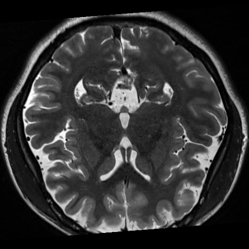</td>
<td></td>
<td></td>
</tr>

<tr>
<td></td>
<td></td>
<td></td>
</tr>

<tr>
<td>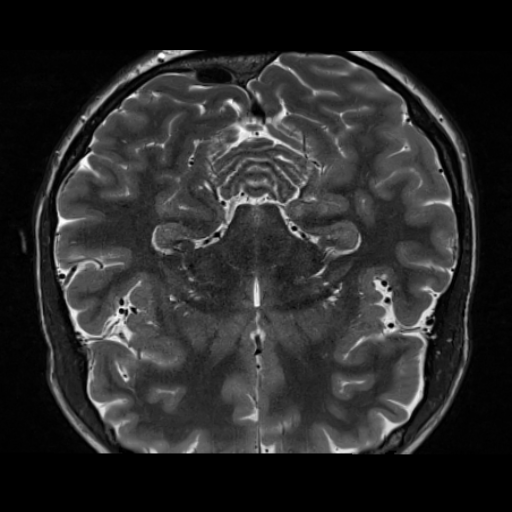</td>
<td>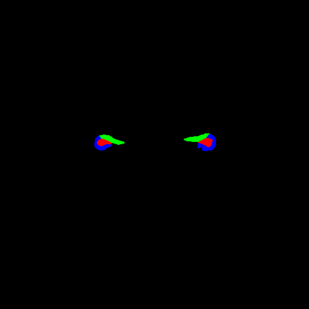</td>
<td>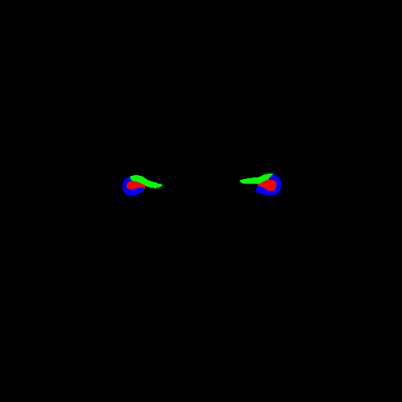</td>
</tr>

<tr>
<td>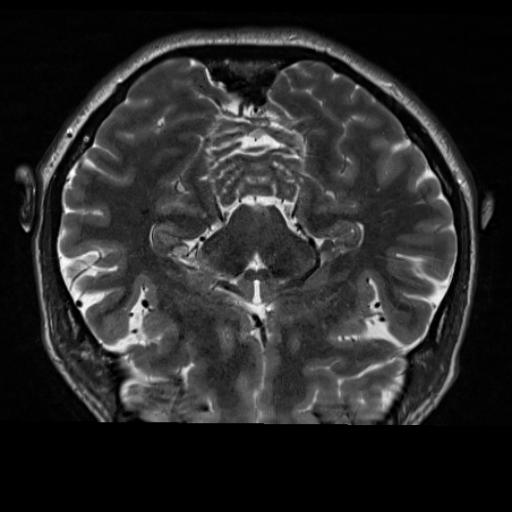</td>
<td>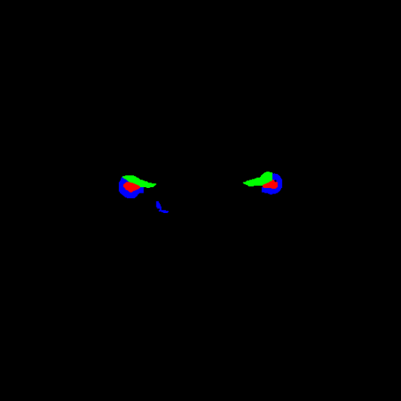</td>
<td>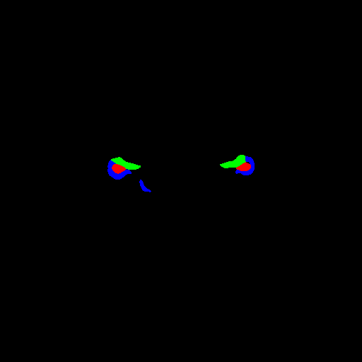</td>
</tr>

<tr>
<td>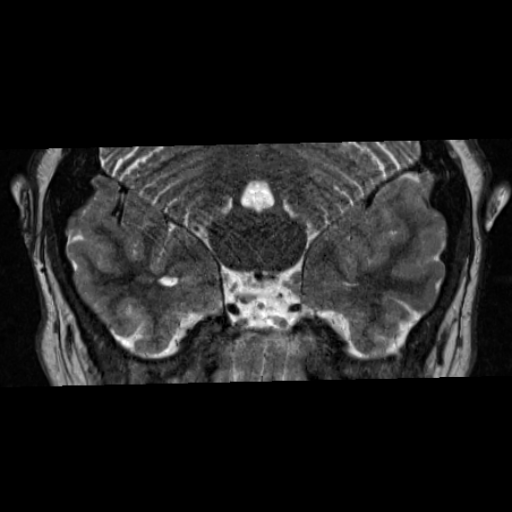</td>
<td></td>
<td>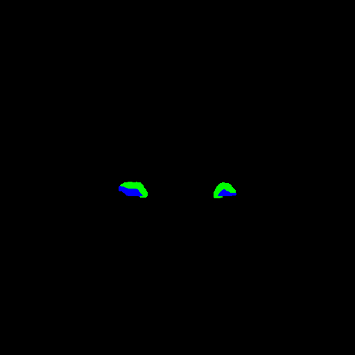</td>
</tr>
</table>

 
<h3>
References
</h3>
<b>1. Multi-contrast submillimetric 3 Tesla hippocampal subfield segmentation protocol and dataset</b> 
Jessie Kulaga-Yoskovitz, Boris C. Bernhardt, Seok-Jun Hong, Tommaso Mansi, Kevin E. Liang,  
Andre J.W. van der Kouwe, Jonathan Smallwood, Andrea Bernasconi & Neda Bernasconi 
<a href="https://www.nature.com/articles/sdata201559">https://www.nature.com/articles/sdata201559</a>
  
<b>2. A paired dataset of multi-modal MRI at 3 Tesla and 7 Tesla with manual hippocampal subfield segmentations</b> 
Lei Chu, Baoqiang Ma, Xiaoxi Dong, Yirong He, Tongtong Che, Debin Zeng, Zihao Zhang & Shuyu Li 
<a href="https://www.nature.com/articles/s41597-025-04586-9?fromPaywallRec=false">
https://www.nature.com/articles/s41597-025-04586-9?fromPaywallRec=false</a>
  
<b>3. A novel deep learning based hippocampus subfield segmentation method</b> 
JoséV. Manjón, José E. Romero & Pierrick Coupe 
<a href="https://www.nature.com/articles/s41598-022-05287-8.pdf">https://www.nature.com/articles/s41598-022-05287-8.pdf</a>
  
<b>4. DSnet: a new dual‑branch network for hippocampus subfield segmentation</b> 
Hancan Zhu, Wangang Cheng, Keli Hu & Guanghua He 
<a href="https://www.researchgate.net/publication/381961150_DSnet_a_new_dual-branch_network_for_hippocampus_subfield_segmentation">
https://www.researchgate.net/publication/381961150_DSnet_a_new_dual-branch_network_for_hippocampus_subfield_segmentation</a>
  
<b>5. TensorFlow-FlexUNet-Image-Segmentation-Model</b> 
Toshiyuki Arai  
<a href="https://github.com/sarah-antillia/TensorFlow-FlexUNet-Image-Segmentation-Model">
TensorFlow-FlexUNet-Image-Segmentation-Model
</a>
 
 
